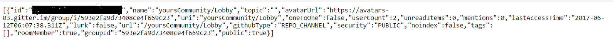
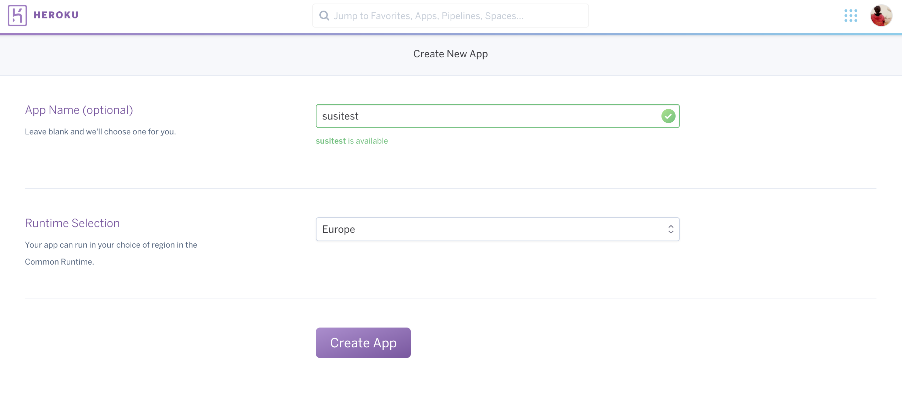
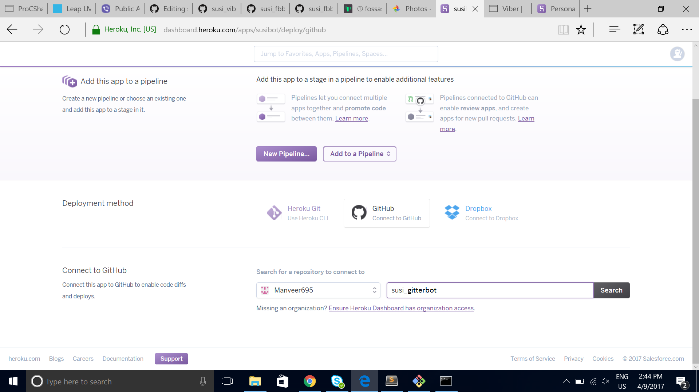
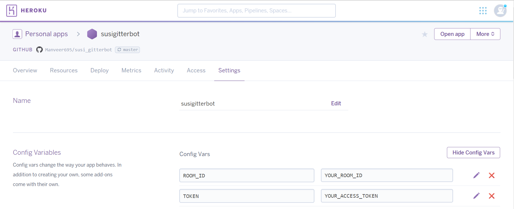
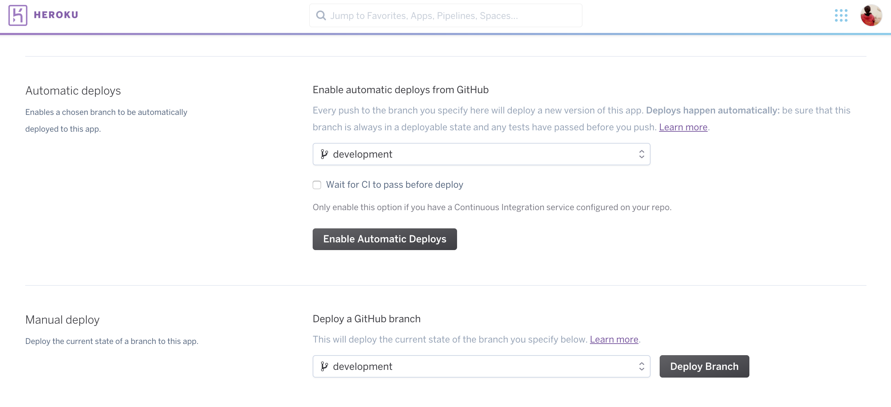

# Getting Started : Gitter Susi AI Bot Installation 

Create a github or twitter account. Now you need to sign in to Gitter with a twitter or github account from [here](https://gitter.im). 

We will be using the streaming API of Gitter to deploy SUSI chat bot to Gitter. You can read the [documentation](https://developer.gitter.im/docs/streaming-api) and get familiar with the API.

## Prerequisites
To create your account on -:
1. Github
2. Gitter
3. Heroku

## SUSI.AI Gitter messenger bot

Feel free to play around with the already built [SUSI.AI bot](https://gitter.im/susiaitest/Lobby) on Gitter. This room will reply to the queries when mentioned with "@susiai". So we can try asking SUSI.AI our queries, for example - @susiai BTC to INR [here](https://gitter.im/susiaitest/Lobby).

## Setup your own Messenger Bot

1. Fork this repository.

2. Create your community by visiting this [page](https://gitter.im/home/explore#createcommunity). After writing your community name press next, invite the people you want to be in this room and press next. You will be redirected to your communities lobby. This lobby is the chat room to which we will deploy our SUSI AI.

3. Now visit the gitter developer [page](https://developer.gitter.im/docs/welcome), press sign in on the top right. You will be redirected to your apps page. Copy the personal access token written there.

4. On a new tab, in your browser visit https://api.gitter.im/v1/rooms?access_token=YOUR_ACCESS_TOKEN, with YOUR_ACCESS_TOKEN replaced by the token we just copied. 
A JSON object will be shown on our browser screen. You will see the value of 'name' key as YOUR_COMMUNITY_NAME/Lobby. Copy the id of this chat room, as we will need it later. You can refer to the image below, you will have your chat room id in the area coloured black.

5. Create a new heroku app [here](https://dashboard.heroku.com/new?org=personal-apps).

 This app will accept the requests from Gitter and Susi api.
 
 

6. Connect the heroku app to the forked repository.
 
 Connect the app to Github
 

7. Set the config variables for this heroku app in the setting tab of your account. Set ROOM_ID to the id of the chat room and TOKEN to the personal access token.

8. Deploy on development branch. If you intend to contribute, it is recommended to Enable Automatic Deploys.

 Branch Deployment.
 

 Successful Deployment.
 
 

9. Go to the your Gitter room created and enjoy chatting with Susi.

